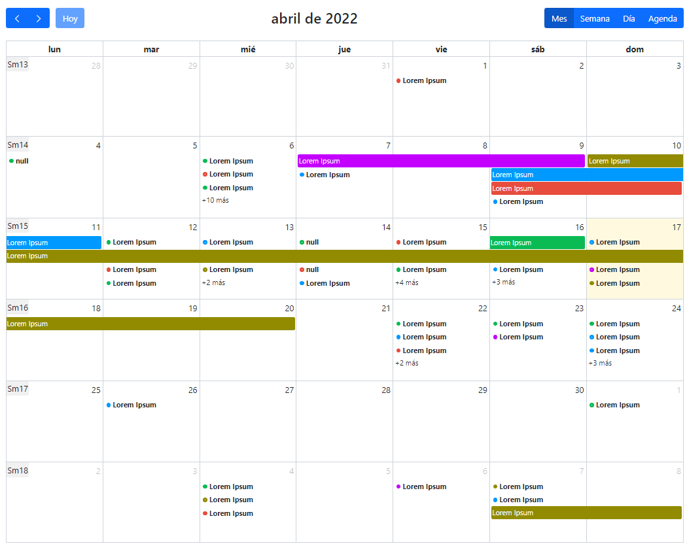
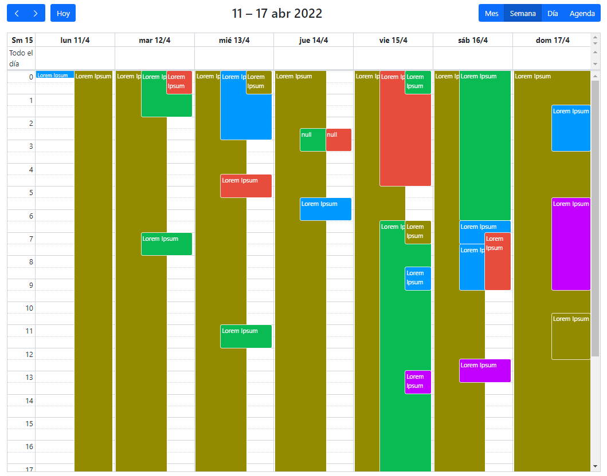
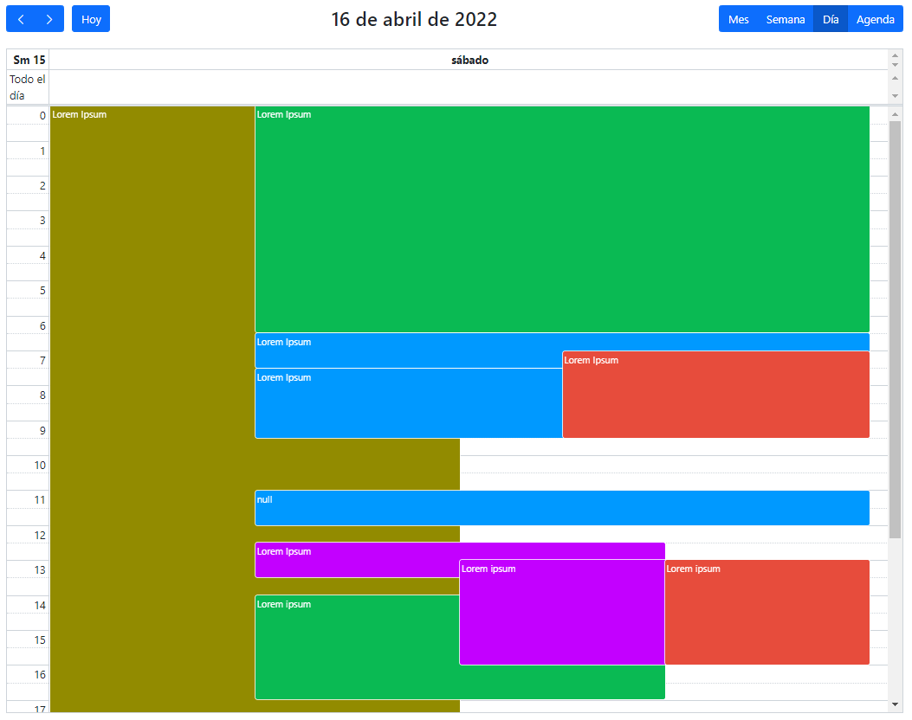
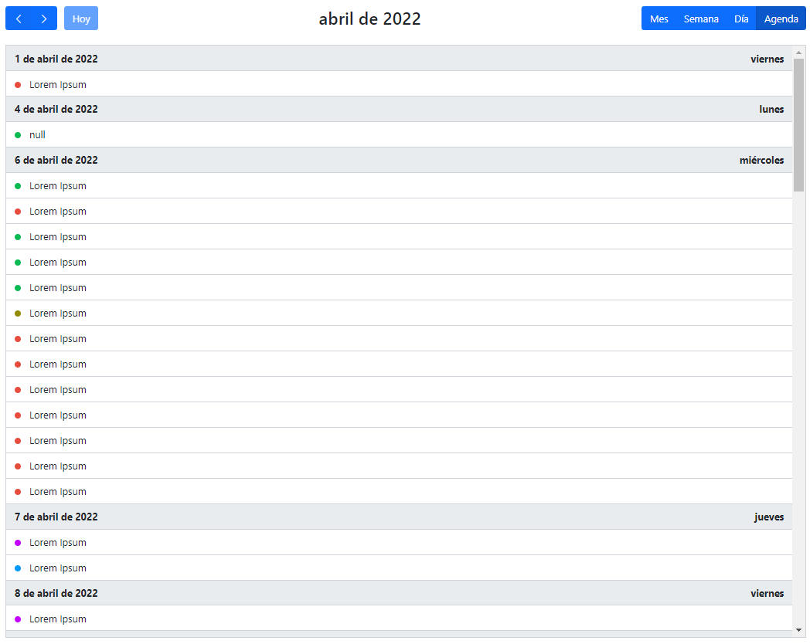
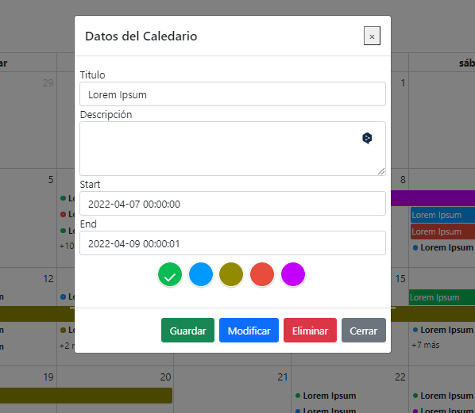
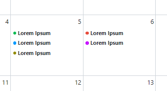
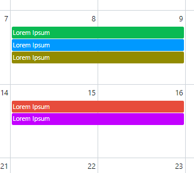

<p align="center">
<a href="https://laravel.com/docs/9.x"></a>
<a href="https://www.php.net/docs.php"></a>
<a href="https://opensource.org/licenses/MIT"></a>
<a href="https://www.mysql.com/"></a>
<a href="https://getbootstrap.com/docs/5.0/getting-started/download/"></a>
<a href="https://github.com/fullcalendar"></a>
</p>

## Instalación

Una vez hayamos clonado el repositorio de nuestro proyecto Laravel en local, debemos hacer los siguientes ajustes para que éste pueda correr en nuestro equipo.

- Instalar dependencias
- Crear una base de datos
- Crear el archivo .env
- Generar una clave
- Migrar y sembrar la base de datos

## Instalar dependencias

Instalaremos con [Composer](https://getcomposer.org/), el manejador de dependencias para PHP, las dependencias definidos en el archivo `composer.json`. Para ello abriremos una terminal en la `carpeta del proyecto` y ejecutaremos:
```
composer install
```
También debemos instalar las dependencias de NPM definidas en el archivo `package.json` con:
```
npm install
```
## Crear una base de datos que soporte Laravel
Entre las `bases de datos` que soporta `Laravel por defecto`, encontramos: MySQL, SQL Lite, PostgreSQL y SQL Server.
## Crear el archivo .env
Podemos duplicar el archivo `.env.example`, renombrarlo a `.env` e incluir los datos de conexión de la base de datos que indicamos en el paso anterior.
### ejemplo archivo .env
```
..... 
DB_CONNECTION=mysql
DB_HOST=localhost
DB_PORT=3306
DB_DATABASE=calendario
DB_USERNAME=root
DB_PASSWORD=toor
....
```
## Generar una clave
La `clave de aplicación` es una cadena aleatoria almacenada en la clave APP_KEY dentro del archivo `.env`.

Para crear la nueva clave e insertarla automáticamente en el .env, ejecutaremos:
```
php artisan key:generate
```
## Ejecutar migraciones
Por último, ejecutamos las migraciones para que se generen las tablas con:
```
php artisan migrate 
```
Si tuvieramos que incluir o crear nuevas migraciones utilizaríamos:
```
php artisan migrate:refresh 
php artisan migrate:fresh  //borra y crea todas las tablas de nuevo
```
Con esto ya tendría que correr sin problemas la aplicación de Laravel que hemos clonado.

## Calendario fotos















## License

[MIT license](https://opensource.org/licenses/MIT).
